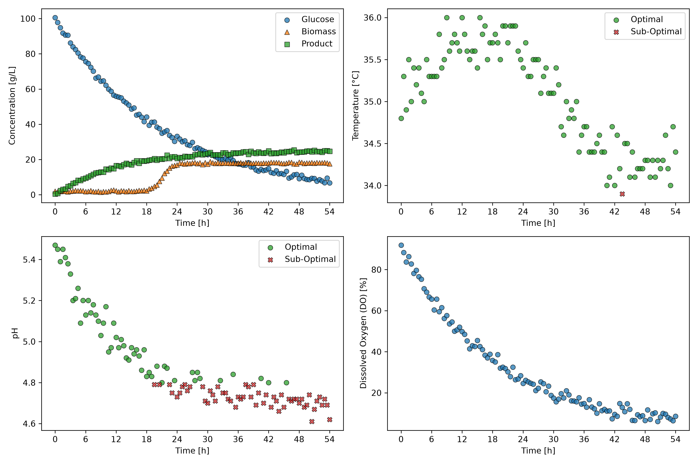

# Bioprocess Monitor

A Python tool that turns raw fermentation time-series data into per-batch monitoring dashboards and summary tables, flagging when pH and temperature drift outside their acceptable operating ranges.

## Overview

In batch fermentation, cells convert substrate into product efficiently only while process conditions such as pH and temperature stay within a defined operating window. Raw process logs, however, are long tables of time-stamped measurements, which makes it hard to see which batch deviated, when it happened, and what it cost.

This project automates that check. It reads a multi-batch fermentation dataset, evaluates every measurement against user-defined operating limits, and produces a visual dashboard for each batch together with a summary table that compares batches side by side. Because the limits are parameters, the same data can be re-evaluated under different operating specifications without changing any code.

## Features

- Loads a multi-batch fermentation dataset from a CSV file
- Extracts the time-series data of any single batch
- Flags each pH and temperature measurement as within or outside its acceptable range
- Counts the number of batches in the dataset
- Generates a 2 × 2 dashboard per batch (concentrations, temperature, pH, dissolved oxygen) that highlights out-of-range measurements
- Exports a per-batch summary table with the percentage of in-range pH and temperature measurements and the final product concentration
- Supports configurable operating limits, so the analysis can be repeated under different specifications

## Technologies used

- Python 3.14.7
- pandas 3.0.5 — data loading, filtering, and aggregation
- Matplotlib 3.11.0 — dashboard figures

## Code design

The project is built around one class, `BioprocessMonitor` (`src/classes.py`), and a driver script, `main.py`.

Running `python main.py` from the project root:

1. Defines two operating specifications: **Mode A** (pH 4.8–5.6, 34.0–36.0 °C) and a stricter **Mode B** (pH 5.1–5.5, 34.5–35.5 °C).
2. For each mode, creates a `BioprocessMonitor` object that loads `datasets/dataset_fermentation.csv` and stores that mode's limits.
3. Loops over every batch and calls `export_dashboard()`, saving one figure per batch and mode to `figures/` (10 figures in total, e.g. `Batch_005_Mode_A.png`).
4. Calls `export_summary()` once per mode, saving `tables/Summary_Mode_A.csv` and `tables/Summary_Mode_B.csv`.

Inside the class, `extract_batch()` selects one batch with a boolean mask, and `optimal_ph_mask()` and `optimal_temperature_mask()` return `True` for each measurement that lies within the limits (inclusive). Both `export_dashboard()` and `export_summary()` reuse these methods, so the in-range logic is defined in a single place.

## Dashboard

The dashboard above shows **Batch 5** evaluated against the Mode A limits. Green circles are measurements within the operating range and red crosses are measurements outside it.

- **Top-left (concentrations):** glucose is consumed steadily over the 54 h run, and biomass grows mainly between about 18 h and 26 h. Product accumulates quickly at first but levels off at around 20–25 g/L.
- **Top-right (temperature):** temperature stays within 34.0–36.0 °C for almost the entire run; only one reading near 43 h falls below the lower limit.
- **Bottom-left (pH):** pH declines steadily from about 5.5 and falls below the 4.8 lower limit at roughly 20 h, remaining mostly out of range for the rest of the batch.
- **Bottom-right (dissolved oxygen):** dissolved oxygen drops from about 90 % to below 10 % as the culture grows.

Product formation slows down during the same period in which pH leaves its operating range, which makes pH control (e.g. base dosing) the first thing to investigate for this batch.

## Summary table

Summary of all batches under the Mode A limits (`tables/Summary_Mode_A.csv`):

| batch_id | ph_optimal_percent | temperature_optimal_percent | C_product_g_L^-1_final |
|---:|---:|---:|---:|
| 1 | 93.81 | 97.94 | 46.5 |
| 2 | 96.69 | 97.52 | 50.8 |
| 3 | 95.89 | 93.15 | 44.6 |
| 4 | 100.0 | 96.47 | 48.6 |
| 5 | 48.62 | 99.08 | 24.7 |

Each row summarizes one batch: the percentage of pH measurements within range, the percentage of temperature measurements within range, and the product concentration at the end of the run. Batches 1–4 kept pH within range for 93.81–100 % of their measurements and finished with 44.6–50.8 g/L of product. **Batch 5 stands out:** only 48.62 % of its pH measurements were within range and it finished with 24.7 g/L, roughly half of the other batches, even though its temperature compliance (99.08 %) was the highest of all five. This points to pH, rather than temperature, as the parameter to investigate.

Under the stricter Mode B limits (`tables/Summary_Mode_B.csv`), the in-range percentages drop for every batch, and Batch 5 again has the lowest pH compliance (16.51 %).

## Acknowledgements

Parts of the implementation and this README were developed with assistance from an AI tool (Claude). All outputs were reviewed and verified against the provided example results.